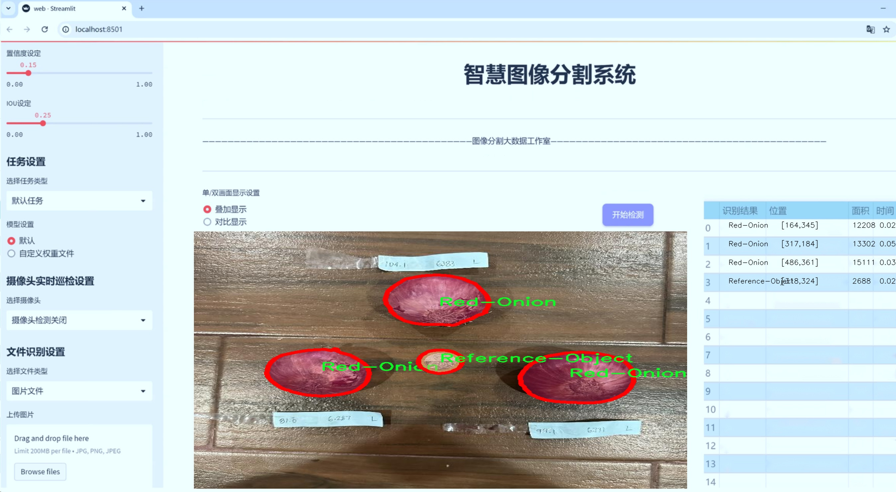
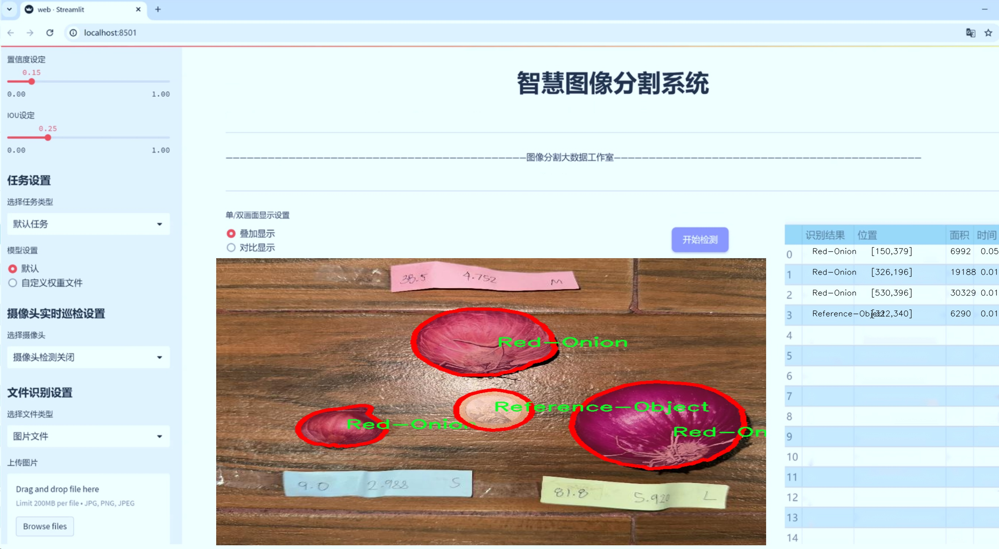
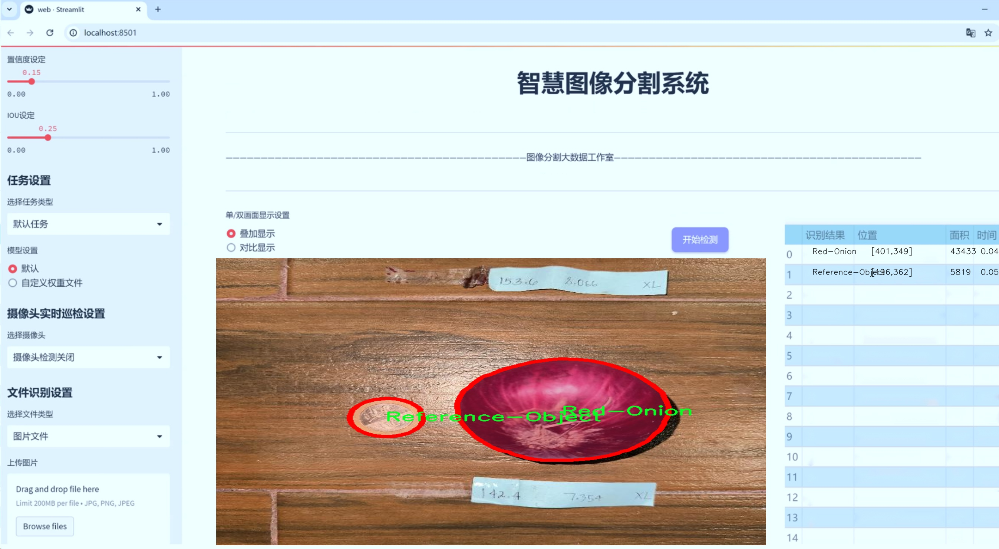
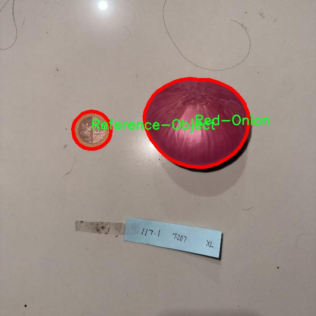
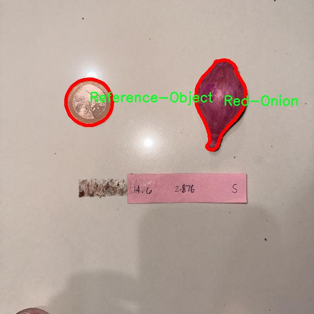
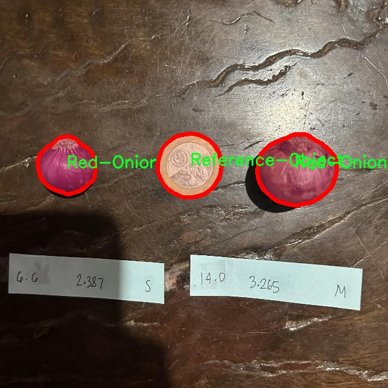
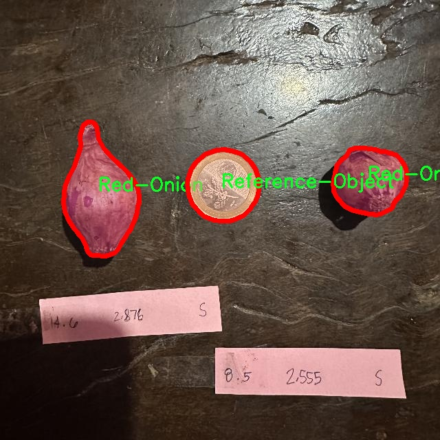
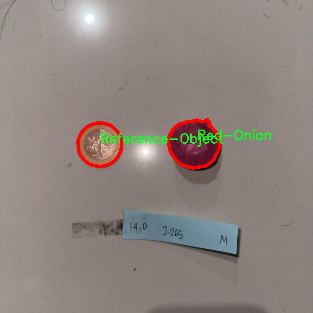

# 洋葱图像分割系统： yolov8-seg-C2f-DWR

### 1.研究背景与意义

[参考博客](https://gitee.com/YOLOv8_YOLOv11_Segmentation_Studio/projects)

[博客来源](https://kdocs.cn/l/cszuIiCKVNis)

研究背景与意义

随着农业现代化的不断推进，精准农业逐渐成为提高农作物产量和质量的重要手段。在这一背景下，计算机视觉技术的应用日益广泛，尤其是在农作物的监测与管理方面。洋葱作为一种重要的经济作物，其种植面积和产量在全球范围内均占据重要地位。然而，传统的洋葱种植管理方式往往依赖人工经验，效率低下且容易受到主观因素的影响。因此，开发一种高效、准确的洋葱图像分割系统，能够为洋葱的生长监测、病虫害检测以及产量预测等提供科学依据，具有重要的现实意义。

在图像处理领域，YOLO（You Only Look Once）系列模型因其快速的检测速度和较高的准确率而受到广泛关注。YOLOv8作为该系列的最新版本，结合了深度学习的最新进展，能够在实时性和精确性之间取得良好的平衡。然而，针对特定农作物的图像分割任务，YOLOv8的标准模型可能无法充分满足实际需求。因此，基于YOLOv8的改进版本，专门针对洋葱图像进行分割，将有助于提升模型在复杂环境下的表现。

本研究所使用的数据集包含4800张洋葱图像，涵盖了红洋葱、黄洋葱和参考物体三类，具有较高的多样性和代表性。这一数据集的构建为模型的训练和测试提供了坚实的基础。通过对不同种类洋葱的图像进行标注和分类，研究者能够更好地理解洋葱在不同生长阶段的特征，进而优化模型的学习过程。此外，数据集中包含的参考物体有助于提高模型的分割精度，使其在实际应用中能够更好地区分洋葱与背景环境。

在研究意义方面，基于改进YOLOv8的洋葱图像分割系统不仅能够提高洋葱的种植管理效率，还能为其他农作物的图像分割提供借鉴。通过实现高效的图像分割，农民可以更及时地获取洋葱的生长状态信息，从而做出更科学的管理决策。此外，该系统的成功应用将为农业智能化发展提供新的思路和方法，推动农业科技的进步。

综上所述，基于改进YOLOv8的洋葱图像分割系统的研究，既是对现有图像处理技术的应用与拓展，也是对农业生产方式的创新与变革。通过提升洋葱的图像分割精度与效率，本研究不仅能够为洋葱种植提供科学依据，还将为实现农业的可持续发展贡献力量。

### 2.图片演示







注意：本项目提供完整的训练源码数据集和训练教程,由于此博客编辑较早,暂不提供权重文件（best.pt）,需要按照6.训练教程进行训练后实现上图效果。

### 3.视频演示

[3.1 视频演示](https://www.bilibili.com/video/BV1x66wYREVV/)

### 4.数据集信息

##### 4.1 数据集类别数＆类别名

nc: 3
names: ['Red-Onion', 'Reference-Object', 'Yellow-Onion']


##### 4.2 数据集信息简介

数据集信息展示

在现代计算机视觉领域，图像分割技术的应用越来越广泛，尤其是在农业和食品工业中，洋葱的分割与识别成为了一个重要的研究方向。为此，我们构建了一个名为“Onion Segmentation”的数据集，旨在为改进YOLOv8-seg模型提供高质量的训练数据，以提升其在洋葱图像分割任务中的性能。该数据集包含了多种洋葱图像，涵盖了不同的种类和背景，以确保模型能够在各种条件下进行有效的分割。

“Onion Segmentation”数据集共包含三类目标，分别是红洋葱（Red-Onion）、参考物体（Reference-Object）和黄洋葱（Yellow-Onion）。每一类的图像均经过精心挑选和标注，以确保数据的多样性和代表性。红洋葱作为一种常见的食材，其深紫色的外皮和白色的内层使其在图像中具有较强的辨识度。为了增强模型的鲁棒性，数据集中包含了不同光照条件、不同拍摄角度以及不同背景下的红洋葱图像。这些图像不仅展示了红洋葱的外观特征，还包括了与其他物体的相对位置，以帮助模型学习如何在复杂场景中进行分割。

参考物体（Reference-Object）类别的引入，旨在为模型提供一个基准点，使其能够更好地理解和区分洋葱与其他物体的关系。这一类别的图像包括了各种常见的物体，如盘子、刀具和其他厨房用具，这些物体的存在有助于模型在实际应用中识别洋葱的边界，避免误分割。通过将参考物体与洋葱图像结合，模型能够学习到更为复杂的背景信息，从而提高其在真实场景中的应用能力。

黄洋葱（Yellow-Onion）作为另一种常见的洋葱类型，其特征与红洋葱有所不同，主要表现为其金黄色的外皮和较为圆润的形状。数据集中包含了多种黄洋葱的图像，涵盖了不同的成熟度和大小，以帮助模型学习到黄洋葱的多样性。这一类别的图像同样注重背景的多样性，确保模型能够在不同的环境中进行有效的分割。

为了确保数据集的质量和有效性，我们对每一张图像进行了详细的标注，使用了专业的图像标注工具，以确保每个目标的边界清晰可见。这一过程不仅提高了数据集的准确性，也为后续的模型训练提供了坚实的基础。此外，数据集还包含了丰富的图像信息，如图像的分辨率、拍摄设备、拍摄时间等，这些信息将为研究人员在模型优化和性能评估中提供有价值的参考。

综上所述，“Onion Segmentation”数据集的构建不仅为改进YOLOv8-seg模型提供了必要的训练数据，也为洋葱图像分割领域的研究提供了重要的基础。通过对红洋葱、黄洋葱及参考物体的全面覆盖，该数据集旨在提升模型的分割精度和鲁棒性，为未来的农业自动化和智能化提供有力支持。











### 5.项目依赖环境部署教程（零基础手把手教学）

[5.1 环境部署教程链接（零基础手把手教学）](https://www.bilibili.com/video/BV1jG4Ve4E9t/?vd_source=bc9aec86d164b67a7004b996143742dc)


[5.2 安装Python虚拟环境创建和依赖库安装视频教程链接（零基础手把手教学）](https://www.bilibili.com/video/BV1nA4VeYEze/?vd_source=bc9aec86d164b67a7004b996143742dc)

### 6.手把手YOLOV8-seg训练视频教程（零基础手把手教学）

[6.1 手把手YOLOV8-seg训练视频教程（零基础小白有手就能学会）](https://www.bilibili.com/video/BV1cA4VeYETe/?vd_source=bc9aec86d164b67a7004b996143742dc)


按照上面的训练视频教程链接加载项目提供的数据集，运行train.py即可开始训练



     Epoch   gpu_mem       box       obj       cls    labels  img_size
     1/200     0G   0.01576   0.01955  0.007536        22      1280: 100%|██████████| 849/849 [14:42<00:00,  1.04s/it]
               Class     Images     Labels          P          R     mAP@.5 mAP@.5:.95: 100%|██████████| 213/213 [01:14<00:00,  2.87it/s]
                 all       3395      17314      0.994      0.957      0.0957      0.0843

     Epoch   gpu_mem       box       obj       cls    labels  img_size
     2/200     0G   0.01578   0.01923  0.007006        22      1280: 100%|██████████| 849/849 [14:44<00:00,  1.04s/it]
               Class     Images     Labels          P          R     mAP@.5 mAP@.5:.95: 100%|██████████| 213/213 [01:12<00:00,  2.95it/s]
                 all       3395      17314      0.996      0.956      0.0957      0.0845

     Epoch   gpu_mem       box       obj       cls    labels  img_size
     3/200     0G   0.01561    0.0191  0.006895        27      1280: 100%|██████████| 849/849 [10:56<00:00,  1.29it/s]
               Class     Images     Labels          P          R     mAP@.5 mAP@.5:.95: 100%|███████   | 187/213 [00:52<00:00,  4.04it/s]
                 all       3395      17314      0.996      0.957      0.0957      0.0845


### 7.50+种全套YOLOV8-seg创新点加载调参实验视频教程（一键加载写好的改进模型的配置文件）

[7.1 50+种全套YOLOV8-seg创新点加载调参实验视频教程（一键加载写好的改进模型的配置文件）](https://www.bilibili.com/video/BV1Hw4VePEXv/?vd_source=bc9aec86d164b67a7004b996143742dc)

### YOLOV8-seg算法简介

原始YOLOv8-seg算法原理

YOLOv8-seg算法是YOLO系列中的最新版本，专注于目标检测与分割任务，结合了高效的目标定位与精确的像素级分割能力。该算法在YOLOv8的基础上进行了优化，特别是在处理复杂场景和多尺度目标时，展现出更为优越的性能。YOLOv8-seg的架构由输入层、主干网络、颈部网络和头部网络等主要组件构成，整体设计旨在实现高效、准确的目标检测与分割。

在YOLOv8-seg的工作流程中，首先，输入图像经过预处理，包括缩放和归一化，以适应网络的输入要求。主干网络作为特征提取的核心，采用了一系列卷积层进行下采样，逐步提取图像的深层特征。每个卷积层不仅进行特征提取，还引入了批归一化和SiLUR激活函数，以增强网络的非线性表达能力和收敛速度。主干网络的设计借鉴了YOLOv7中的E-ELAN结构，通过C2f模块的跨层分支连接，进一步提升了模型的梯度流动性，从而改善了特征提取的效果。

在主干网络的末尾，YOLOv8-seg引入了快速空间金字塔池化（SPPFl）模块，通过三个最大池化层对多尺度特征进行处理。这一设计不仅增强了网络的特征抽象能力，还有效提升了模型对不同尺度目标的适应性。接下来，颈部网络利用特征金字塔网络（FPN）和路径聚合网络（PAN）结构，融合来自不同尺度的特征图信息。这一融合过程能够有效整合高层语义信息与低层细节信息，为后续的目标检测与分割提供了更为丰富的特征支持。

YOLOv8-seg的头部网络则采用了解耦的检测头设计，分别计算目标的回归和分类损失。这种解耦设计使得模型在处理复杂场景时能够更专注于各自的任务，减少了定位不准和分类错误的发生。通过将分类和回归任务分开，YOLOv8-seg在多目标检测和分割任务中展现出了更高的准确性和鲁棒性。

与传统的目标检测方法不同，YOLOv8-seg采用了Anchor-free的目标检测策略。这一策略的核心在于通过回归方式直接预测目标的位置和大小，避免了传统方法中对锚点框的依赖。这种设计不仅简化了模型的训练过程，还使得网络能够更快速地聚焦于目标位置的邻近点，从而生成更为精确的预测框。YOLOv8-seg在这一方面的创新，使得模型在面对不同尺度和形状的目标时，能够自适应地调整预测框，提升了检测的灵活性和准确性。

在具体实现上，YOLOv8-seg的网络结构由五种不同的变体组成，分别为YOLOv8n、YOLOv8s、YOLOv8m、YOLOv8l和YOLOv8x。这些变体在主干网络的层数和残差块的数量上有所不同，但它们的基本原理和架构设计保持一致。这种多样化的设计使得YOLOv8-seg能够在不同的应用场景中，根据计算资源和精度需求进行灵活选择。

在训练过程中，YOLOv8-seg采用了新的PyTorch训练和部署框架，极大地简化了自定义模型的训练流程。通过高效的训练策略和优化算法，YOLOv8-seg能够在较短的时间内完成模型的训练，同时保持较高的检测精度。这一优势使得YOLOv8-seg不仅适用于学术研究，也在工业界得到了广泛应用，尤其是在实时目标检测和分割任务中，展现出了良好的性能。

总的来说，YOLOv8-seg算法通过其创新的网络结构、灵活的特征融合策略和高效的目标检测方法，成功地将目标检测与分割任务结合在一起，推动了计算机视觉领域的发展。其在复杂场景下的优越表现和高效性，使得YOLOv8-seg成为当前目标检测与分割任务中的一项重要技术，为未来的研究和应用提供了广阔的前景。


### 9.系统功能展示（检测对象为举例，实际内容以本项目数据集为准）

图9.1.系统支持检测结果表格显示

  图9.2.系统支持置信度和IOU阈值手动调节

  图9.3.系统支持自定义加载权重文件best.pt(需要你通过步骤5中训练获得)

  图9.4.系统支持摄像头实时识别

  图9.5.系统支持图片识别

  图9.6.系统支持视频识别

  图9.7.系统支持识别结果文件自动保存

  图9.8.系统支持Excel导出检测结果数据


### 10.50+种全套YOLOV8-seg创新点原理讲解（非科班也可以轻松写刊发刊，V11版本正在科研待更新）

#### 10.1 由于篇幅限制，每个创新点的具体原理讲解就不一一展开，具体见下列网址中的创新点对应子项目的技术原理博客网址【Blog】：


[10.1 50+种全套YOLOV8-seg创新点原理讲解链接](https://gitee.com/qunmasj/good)

#### 10.2 部分改进模块原理讲解(完整的改进原理见上图和技术博客链接)【如果此小节的图加载失败可以通过CSDN或者Github搜索该博客的标题访问原始博客，原始博客图片显示正常】
### CBAM空间注意力机制
近年来，随着深度学习研究方向的火热，注意力机制也被广泛地应用在图像识别、语音识别和自然语言处理等领域，注意力机制在深度学习任务中发挥着举足轻重的作用。注意力机制借鉴于人类的视觉系统，例如，人眼在看到一幅画面时，会倾向于关注画面中的重要信息，而忽略其他可见的信息。深度学习中的注意力机制和人类视觉的注意力机制相似，通过扫描全局数据，从大量数据中选择出需要重点关注的、对当前任务更为重要的信息，然后对这部分信息分配更多的注意力资源，从这些信息中获取更多所需要的细节信息，而抑制其他无用的信息。而在深度学习中，则具体表现为给感兴趣的区域更高的权重，经过网络的学习和调整，得到最优的权重分配，形成网络模型的注意力，使网络拥有更强的学习能力，加快网络的收敛速度。
注意力机制通常可分为软注意力机制和硬注意力机制[4-5]。软注意力机制在选择信息时，不是从输入的信息中只选择1个，而会用到所有输入信息，只是各个信息对应的权重分配不同，然后输入网络模型进行计算;硬注意力机制则是从输入的信息中随机选取一个或者选择概率最高的信息，但是这一步骤通常是不可微的，导致硬注意力机制更难训练。因此，软注意力机制应用更为广泛，按照原理可将软注意力机制划分为:通道注意力机制（channel attention)、空间注意力机制(spatial attention）和混合域注意力机制(mixed attention)。
通道注意力机制的本质建立各个特征通道之间的重要程度，对感兴趣的通道进行重点关注，弱化不感兴趣的通道的作用;空间注意力的本质则是建模了整个空间信息的重要程度，然后对空间内感兴趣的区域进行重点关注，弱化其余非感兴趣区域的作用;混合注意力同时运用了通道注意力和空间注意力，两部分先后进行或并行，形成对通道特征和空间特征同时关注的注意力模型。

卷积层注意力模块(Convolutional Block Attention Module，CBAM）是比较常用的混合注意力模块，其先后集中了通道注意力模块和空间注意力模块，网络中加入该模块能有效提高网络性能，减少网络模型的计算量，模块结构如图所示。输入特征图首先经过分支的通道注意力模块，然后和主干的原特征图融合，得到具有通道注意力的特征图，接着经过分支的空间注意力模块，在和主干的特征图融合后，得到同时具有通道特征注意力和空间特征注意力的特征图。CBAM模块不改变输入特征图的大小，因此该模块是一个“即插即用”的模块，可以插入网络的任何位置。

通道注意力模块的结构示意图如图所示，通道注意力模块分支并行地对输入的特征图进行最大池化操作和平均池化操作，然后利用多层感知机对结果进行变换，得到应用于两个通道的变换结果，最后经过sigmoid激活函数将变换结果融合，得到具有通道注意力的通道特征图。

空间注意力模块示意图如图所示，将通道注意力模块输出的特征图作为该模块的输入特征图，首先对输入特征图进行基于通道的最大池化操作和平均池化操作，将两部分得到的结果拼接起来，然后通过卷积得到降为Ⅰ通道的特征图，最后通过sigmoid激活函数生成具有空间注意力的特征图。


### 11.项目核心源码讲解（再也不用担心看不懂代码逻辑）

#### 11.1 ultralytics\utils\callbacks\neptune.py

以下是对给定代码的核心部分进行分析和详细注释的结果：

```python
# 导入必要的库和模块
from ultralytics.utils import LOGGER, SETTINGS, TESTS_RUNNING

# 尝试导入NeptuneAI库并进行基本的设置检查
try:
    assert not TESTS_RUNNING  # 确保当前不是在进行测试
    assert SETTINGS['neptune'] is True  # 确保Neptune集成已启用
    import neptune
    from neptune.types import File

    assert hasattr(neptune, '__version__')  # 确保Neptune库有版本属性

    run = None  # 初始化NeptuneAI实验记录实例

except (ImportError, AssertionError):
    neptune = None  # 如果导入失败，则将neptune设置为None


def _log_scalars(scalars, step=0):
    """将标量数据记录到NeptuneAI实验记录器中。"""
    if run:  # 如果Neptune实例已初始化
        for k, v in scalars.items():  # 遍历标量字典
            run[k].append(value=v, step=step)  # 记录每个标量


def _log_images(imgs_dict, group=''):
    """将图像记录到NeptuneAI实验记录器中。"""
    if run:  # 如果Neptune实例已初始化
        for k, v in imgs_dict.items():  # 遍历图像字典
            run[f'{group}/{k}'].upload(File(v))  # 上传每个图像


def _log_plot(title, plot_path):
    """
    将绘图记录到NeptuneAI实验记录器中。

    参数:
        title (str): 绘图的标题。
        plot_path (PosixPath | str): 保存的图像文件路径。
    """
    import matplotlib.image as mpimg
    import matplotlib.pyplot as plt

    img = mpimg.imread(plot_path)  # 读取图像文件
    fig = plt.figure()  # 创建图形
    ax = fig.add_axes([0, 0, 1, 1], frameon=False, aspect='auto', xticks=[], yticks=[])  # 添加坐标轴
    ax.imshow(img)  # 显示图像
    run[f'Plots/{title}'].upload(fig)  # 上传图像


def on_pretrain_routine_start(trainer):
    """在训练例程开始前调用的回调函数。"""
    try:
        global run
        # 初始化Neptune运行实例
        run = neptune.init_run(project=trainer.args.project or 'YOLOv8', name=trainer.args.name, tags=['YOLOv8'])
        # 记录超参数配置
        run['Configuration/Hyperparameters'] = {k: '' if v is None else v for k, v in vars(trainer.args).items()}
    except Exception as e:
        LOGGER.warning(f'WARNING ⚠️ NeptuneAI安装但未正确初始化，未记录此运行。 {e}')


def on_train_epoch_end(trainer):
    """每个训练周期结束时调用的回调函数。"""
    _log_scalars(trainer.label_loss_items(trainer.tloss, prefix='train'), trainer.epoch + 1)  # 记录训练损失
    _log_scalars(trainer.lr, trainer.epoch + 1)  # 记录学习率
    if trainer.epoch == 1:  # 如果是第一个周期
        # 记录训练批次的图像
        _log_images({f.stem: str(f) for f in trainer.save_dir.glob('train_batch*.jpg')}, 'Mosaic')


def on_fit_epoch_end(trainer):
    """每个适应（训练+验证）周期结束时调用的回调函数。"""
    if run and trainer.epoch == 0:  # 如果Neptune实例已初始化且是第一个周期
        from ultralytics.utils.torch_utils import model_info_for_loggers
        run['Configuration/Model'] = model_info_for_loggers(trainer)  # 记录模型信息
    _log_scalars(trainer.metrics, trainer.epoch + 1)  # 记录指标


def on_val_end(validator):
    """每次验证结束时调用的回调函数。"""
    if run:  # 如果Neptune实例已初始化
        # 记录验证图像
        _log_images({f.stem: str(f) for f in validator.save_dir.glob('val*.jpg')}, 'Validation')


def on_train_end(trainer):
    """训练结束时调用的回调函数。"""
    if run:  # 如果Neptune实例已初始化
        # 记录最终结果和图表
        files = [
            'results.png', 'confusion_matrix.png', 'confusion_matrix_normalized.png',
            *(f'{x}_curve.png' for x in ('F1', 'PR', 'P', 'R'))]
        files = [(trainer.save_dir / f) for f in files if (trainer.save_dir / f).exists()]  # 过滤存在的文件
        for f in files:
            _log_plot(title=f.stem, plot_path=f)  # 记录每个图表
        # 记录最终模型
        run[f'weights/{trainer.args.name or trainer.args.task}/{str(trainer.best.name)}'].upload(File(str(trainer.best)))


# 定义回调函数字典
callbacks = {
    'on_pretrain_routine_start': on_pretrain_routine_start,
    'on_train_epoch_end': on_train_epoch_end,
    'on_fit_epoch_end': on_fit_epoch_end,
    'on_val_end': on_val_end,
    'on_train_end': on_train_end} if neptune else {}
```

### 核心部分分析
1. **NeptuneAI的初始化与配置**：通过`neptune.init_run`初始化实验记录，确保记录训练过程中的超参数和模型信息。
2. **记录标量和图像**：定义了`_log_scalars`和`_log_images`函数，用于记录训练过程中的损失、学习率以及训练和验证图像。
3. **回调函数**：定义了一系列回调函数，在训练的不同阶段（如开始、每个周期结束、验证结束等）进行记录，确保训练过程的可追踪性和可视化。

这些核心部分共同构成了一个完整的训练监控系统，能够有效地记录和可视化训练过程中的重要信息。

这个文件是一个用于集成NeptuneAI的回调函数模块，主要用于在训练YOLO模型时记录实验的各种信息。首先，文件引入了一些必要的库和模块，包括Ultralytics的日志记录器、设置和测试状态的变量。接着，尝试导入Neptune库，并进行一些基本的验证，比如确保没有在运行测试，并且Neptune集成已启用。如果导入失败或验证不通过，则将`neptune`设置为`None`，表示Neptune功能不可用。

接下来，定义了一些用于记录不同类型数据的私有函数。`_log_scalars`函数用于记录标量数据，比如损失值和学习率；`_log_images`函数用于记录图像数据，通常是训练过程中的一些可视化结果；`_log_plot`函数用于记录绘图数据，比如训练过程中的各种图表。该函数使用Matplotlib库读取图像并将其上传到Neptune。

然后，定义了一些回调函数，这些函数会在训练过程中的特定时刻被调用。`on_pretrain_routine_start`函数在训练开始前被调用，负责初始化Neptune的运行实例，并记录超参数配置。如果初始化失败，则会记录警告信息。`on_train_epoch_end`函数在每个训练周期结束时被调用，记录当前周期的损失和学习率，并在第一周期结束时记录训练批次的图像。`on_fit_epoch_end`函数在每个训练和验证周期结束时被调用，记录模型的配置信息和指标。`on_val_end`函数在验证结束时被调用，记录验证阶段的图像。最后，`on_train_end`函数在训练结束时被调用，记录最终的结果、混淆矩阵和其他相关图表，并上传最佳模型的权重。

最后，文件定义了一个字典`callbacks`，将上述回调函数与相应的事件关联起来，只有在Neptune可用的情况下才会填充这个字典。这使得在训练过程中可以灵活地记录各种信息，便于后续的分析和可视化。整体而言，这个文件的主要功能是通过NeptuneAI对YOLO模型的训练过程进行监控和记录，帮助用户更好地理解和优化模型的表现。

#### 11.2 ultralytics\nn\extra_modules\kernel_warehouse.py

以下是代码中最核心的部分，并附上详细的中文注释：

```python
import torch
import torch.nn as nn
import torch.nn.functional as F

class Attention(nn.Module):
    def __init__(self, in_planes, reduction, num_static_cell, num_local_mixture, norm_layer=nn.BatchNorm1d,
                 cell_num_ratio=1.0, nonlocal_basis_ratio=1.0, start_cell_idx=None):
        super(Attention, self).__init__()
        # 计算隐藏层的通道数
        hidden_planes = max(int(in_planes * reduction), 16)
        self.kw_planes_per_mixture = num_static_cell + 1  # 每个混合的通道数
        self.num_local_mixture = num_local_mixture  # 本地混合数
        self.kw_planes = self.kw_planes_per_mixture * num_local_mixture  # 总通道数

        # 计算本地和非本地单元的数量
        self.num_local_cell = int(cell_num_ratio * num_local_mixture)
        self.num_nonlocal_cell = num_static_cell - self.num_local_cell
        self.start_cell_idx = start_cell_idx

        # 定义网络层
        self.avgpool = nn.AdaptiveAvgPool1d(1)  # 自适应平均池化
        self.fc1 = nn.Linear(in_planes, hidden_planes, bias=(norm_layer is not nn.BatchNorm1d))  # 全连接层
        self.norm1 = norm_layer(hidden_planes)  # 归一化层
        self.act1 = nn.ReLU(inplace=True)  # 激活函数

        # 根据非本地基数比率决定网络结构
        if nonlocal_basis_ratio >= 1.0:
            self.map_to_cell = nn.Identity()  # 直接映射
            self.fc2 = nn.Linear(hidden_planes, self.kw_planes, bias=True)  # 第二个全连接层
        else:
            self.map_to_cell = self.map_to_cell_basis  # 使用基数映射
            self.num_basis = max(int(self.num_nonlocal_cell * nonlocal_basis_ratio), 16)  # 基数数量
            self.fc2 = nn.Linear(hidden_planes, (self.num_local_cell + self.num_basis + 1) * num_local_mixture, bias=False)
            self.fc3 = nn.Linear(self.num_basis, self.num_nonlocal_cell, bias=False)  # 第三个全连接层
            self.basis_bias = nn.Parameter(torch.zeros([self.kw_planes], requires_grad=True).float())  # 基数偏置

        self.temp_bias = torch.zeros([self.kw_planes], requires_grad=False).float()  # 温度偏置
        self.temp_value = 0  # 温度值
        self._initialize_weights()  # 初始化权重

    def _initialize_weights(self):
        # 权重初始化
        for m in self.modules():
            if isinstance(m, nn.Linear):
                nn.init.kaiming_normal_(m.weight, mode='fan_out', nonlinearity='relu')  # Kaiming初始化
                if m.bias is not None:
                    nn.init.constant_(m.bias, 0)  # 偏置初始化为0
            if isinstance(m, nn.BatchNorm1d):
                nn.init.constant_(m.weight, 1)  # 归一化权重初始化为1
                nn.init.constant_(m.bias, 0)  # 归一化偏置初始化为0

    def forward(self, x):
        # 前向传播
        x = self.avgpool(x.reshape(*x.shape[:2], -1)).squeeze(dim=-1)  # 平均池化
        x = self.act1(self.norm1(self.fc1(x)))  # 经过全连接层、归一化和激活函数
        x = self.map_to_cell(self.fc2(x)).reshape(-1, self.kw_planes)  # 映射到单元
        x = x / (torch.sum(torch.abs(x), dim=1).view(-1, 1) + 1e-3)  # 归一化
        x = (1.0 - self.temp_value) * x.reshape(-1, self.kw_planes) + self.temp_value * self.temp_bias.to(x.device).view(1, -1)  # 温度调整
        return x.reshape(-1, self.kw_planes_per_mixture)[:, :-1]  # 返回结果

class KWconvNd(nn.Module):
    def __init__(self, in_planes, out_planes, kernel_size, stride=1, padding=0, dilation=1, groups=1,
                 bias=False, warehouse_id=None, warehouse_manager=None):
        super(KWconvNd, self).__init__()
        # 初始化卷积层参数
        self.in_planes = in_planes
        self.out_planes = out_planes
        self.kernel_size = kernel_size  # 卷积核大小
        self.stride = stride  # 步幅
        self.padding = padding  # 填充
        self.dilation = dilation  # 膨胀
        self.groups = groups  # 分组卷积
        self.bias = nn.Parameter(torch.zeros([self.out_planes]), requires_grad=True).float() if bias else None  # 偏置
        self.warehouse_id = warehouse_id  # 仓库ID
        self.warehouse_manager = [warehouse_manager]  # 仓库管理器

    def forward(self, x):
        # 前向传播
        kw_attention = self.attention(x).type(x.dtype)  # 获取注意力权重
        batch_size = x.shape[0]  # 批大小
        x = x.reshape(1, -1, *x.shape[2:])  # 重塑输入
        weight = self.warehouse_manager[0].take_cell(self.warehouse_id).reshape(self.cell_shape[0], -1).type(x.dtype)  # 获取权重
        aggregate_weight = torch.mm(kw_attention, weight)  # 权重聚合
        output = self.func_conv(x, weight=aggregate_weight, bias=None, stride=self.stride, padding=self.padding,
                                dilation=self.dilation, groups=self.groups * batch_size)  # 卷积操作
        output = output.view(batch_size, self.out_planes, *output.shape[2:])  # 重塑输出
        if self.bias is not None:
            output = output + self.bias.reshape(1, -1, *([1]*self.dimension))  # 添加偏置
        return output  # 返回输出
```

### 代码核心部分解释：
1. **Attention类**：实现了一个注意力机制，用于动态调整卷积层的权重。它包含多个全连接层和归一化层，通过输入的特征图生成注意力权重，并根据温度值进行调整。

2. **KWconvNd类**：是一个自定义的卷积层，支持多维卷积（1D、2D、3D）。它通过注意力机制来获取权重，并在前向传播中应用这些权重进行卷积操作。

3. **前向传播**：在`forward`方法中，首先通过注意力机制计算权重，然后使用这些权重进行卷积操作，最后返回卷积结果。

### 其他说明：
- 代码中使用了许多PyTorch的模块，如`nn.Linear`、`nn.BatchNorm1d`等，来构建神经网络。
- 权重初始化和温度调整机制是为了提高模型的训练效果和收敛速度。

这个程序文件`kernel_warehouse.py`是一个用于深度学习中卷积神经网络的模块，主要实现了一个内核仓库管理器和相关的卷积操作。它利用了PyTorch框架，并定义了一些类和函数来处理卷积操作中的内核管理和注意力机制。

首先，文件中导入了一些必要的库，包括PyTorch的核心模块和一些功能模块。`__all__`定义了模块的公共接口，表示`KWConv`和`Warehouse_Manager`这两个类是模块的主要组成部分。

接下来，定义了一个`parse`函数，用于处理输入参数，确保输入是可迭代的，并根据需要重复元素或返回特定长度的列表。

`Attention`类是一个重要的组成部分，它实现了注意力机制。该类的构造函数接受多个参数，包括输入通道数、缩减比例、静态单元数量、局部混合数量等。它包含多个线性层和归一化层，用于计算注意力权重。该类还定义了温度更新和初始化的方法，这在训练过程中可能用于调整注意力的敏感度。

`KWconvNd`类是一个通用的卷积层类，支持多维卷积（1D、2D、3D）。它的构造函数接收输入和输出通道数、卷积核大小、步幅、填充、扩张等参数，并根据这些参数初始化卷积层。`init_attention`方法用于初始化注意力机制，而`forward`方法则定义了前向传播过程。

接下来，`KWConv1d`、`KWConv2d`和`KWConv3d`类分别继承自`KWconvNd`，并实现了一维、二维和三维卷积的具体操作。

`KWLinear`类实现了线性层，内部使用了`KWConv1d`进行处理。

`Warehouse_Manager`类是内核仓库的管理器，负责管理和存储卷积层的内核。它提供了一个`reserve`方法，用于创建卷积层而不实际分配权重，并记录相关信息。`store`方法用于存储内核信息并计算所需的权重。`allocate`方法则在网络中分配内核并初始化权重。

最后，`KWConv`类是一个简单的卷积层包装器，结合了内核仓库和批归一化。它在前向传播中依次调用卷积、归一化和激活函数。

此外，文件还定义了一个`get_temperature`函数，用于计算在训练过程中温度的变化，这可能与注意力机制的动态调整有关。

整体来看，这个文件实现了一个灵活的卷积内核管理和注意力机制，可以用于构建复杂的卷积神经网络，并在训练过程中动态调整内核的使用和权重。

#### 11.3 ultralytics\utils\ops.py

以下是代码中最核心的部分，并附上详细的中文注释：

```python
import torch
import torchvision

def non_max_suppression(
        prediction,
        conf_thres=0.25,
        iou_thres=0.45,
        classes=None,
        agnostic=False,
        multi_label=False,
        labels=(),
        max_det=300,
        nc=0,  # 类别数量（可选）
        max_time_img=0.05,
        max_nms=30000,
        max_wh=7680,
):
    """
    对一组边界框执行非最大抑制（NMS），支持掩码和每个框多个标签。

    参数：
        prediction (torch.Tensor): 形状为 (batch_size, num_classes + 4 + num_masks, num_boxes) 的张量，
            包含预测的框、类别和掩码。张量格式应与模型输出一致，例如 YOLO。
        conf_thres (float): 置信度阈值，低于该值的框将被过滤。有效值在 0.0 和 1.0 之间。
        iou_thres (float): IoU 阈值，低于该值的框在 NMS 过程中将被过滤。有效值在 0.0 和 1.0 之间。
        classes (List[int]): 要考虑的类别索引列表。如果为 None，则考虑所有类别。
        agnostic (bool): 如果为 True，模型对类别数量不敏感，所有类别将被视为一个。
        multi_label (bool): 如果为 True，每个框可能有多个标签。
        labels (List[List[Union[int, float, torch.Tensor]]]): 标签列表，每个内层列表包含给定图像的先验标签。
        max_det (int): NMS 后要保留的最大框数量。
        nc (int, optional): 模型输出的类别数量。该数量之后的索引将被视为掩码。
        max_time_img (float): 处理一张图像的最大时间（秒）。
        max_nms (int): 传递给 torchvision.ops.nms() 的最大框数量。
        max_wh (int): 框的最大宽度和高度（像素）。

    返回：
        (List[torch.Tensor]): 长度为 batch_size 的列表，每个元素是形状为 (num_boxes, 6 + num_masks) 的张量，
            包含保留的框，列为 (x1, y1, x2, y2, confidence, class, mask1, mask2, ...)。
    """

    # 检查置信度和IoU阈值的有效性
    assert 0 <= conf_thres <= 1, f'无效的置信度阈值 {conf_thres}, 有效值在 0.0 和 1.0 之间'
    assert 0 <= iou_thres <= 1, f'无效的IoU {iou_thres}, 有效值在 0.0 和 1.0 之间'
    
    # 如果预测结果是列表或元组，选择推理输出
    if isinstance(prediction, (list, tuple)):
        prediction = prediction[0]  # 选择推理输出

    device = prediction.device  # 获取设备信息
    bs = prediction.shape[0]  # 批大小
    nc = nc or (prediction.shape[1] - 4)  # 类别数量
    nm = prediction.shape[1] - nc - 4  # 掩码数量
    mi = 4 + nc  # 掩码起始索引
    xc = prediction[:, 4:mi].amax(1) > conf_thres  # 置信度候选框

    # 设置
    time_limit = 0.5 + max_time_img * bs  # 超过此时间限制将退出
    multi_label &= nc > 1  # 如果类别数量大于1，支持多标签

    prediction = prediction.transpose(-1, -2)  # 转置张量
    prediction[..., :4] = xywh2xyxy(prediction[..., :4])  # 将xywh格式转换为xyxy格式

    output = [torch.zeros((0, 6 + nm), device=prediction.device)] * bs  # 初始化输出
    for xi, x in enumerate(prediction):  # 遍历每张图像的推理结果
        x = x[xc[xi]]  # 根据置信度筛选框

        # 如果没有框，处理下一张图像
        if not x.shape[0]:
            continue

        # 拆分检测矩阵为框、类别和掩码
        box, cls, mask = x.split((4, nc, nm), 1)

        if multi_label:
            i, j = torch.where(cls > conf_thres)  # 找到多标签的索引
            x = torch.cat((box[i], x[i, 4 + j, None], j[:, None].float(), mask[i]), 1)  # 合并框和标签
        else:  # 仅保留最佳类别
            conf, j = cls.max(1, keepdim=True)
            x = torch.cat((box, conf, j.float(), mask), 1)[conf.view(-1) > conf_thres]

        # 根据类别过滤框
        if classes is not None:
            x = x[(x[:, 5:6] == torch.tensor(classes, device=x.device)).any(1)]

        n = x.shape[0]  # 当前框的数量
        if not n:  # 如果没有框，继续处理下一张图像
            continue
        if n > max_nms:  # 如果框的数量超过最大限制，按置信度排序并保留前max_nms个框
            x = x[x[:, 4].argsort(descending=True)[:max_nms]]

        # 批量执行NMS
        c = x[:, 5:6] * (0 if agnostic else max_wh)  # 类别偏移
        boxes, scores = x[:, :4] + c, x[:, 4]  # 计算框和分数
        i = torchvision.ops.nms(boxes, scores, iou_thres)  # 执行NMS
        i = i[:max_det]  # 限制检测数量

        output[xi] = x[i]  # 保存结果
        if (time.time() - t) > time_limit:  # 检查时间限制
            break  # 超过时间限制，退出

    return output  # 返回处理后的框
```

### 代码核心部分解释：
1. **非最大抑制（NMS）**：该函数的主要功能是对检测到的边界框进行非最大抑制，以消除重叠的框，保留最有可能的框。
2. **参数说明**：函数接收多个参数，包括预测结果、置信度阈值、IoU阈值、类别等，以便进行灵活的框过滤。
3. **框筛选**：根据置信度和类别进行框的筛选和处理，最终返回处理后的框列表。

这段代码是YOLO模型中非常重要的部分，负责后处理阶段的框选择和过滤。

这个程序文件 `ultralytics/utils/ops.py` 是一个与 YOLOv8 相关的工具库，主要用于处理图像中的目标检测和分割任务。文件中包含了多个函数和一个用于性能分析的上下文管理器 `Profile` 类。

首先，`Profile` 类用于测量代码块的执行时间，可以作为装饰器或上下文管理器使用。它在初始化时记录初始时间，并在退出时计算经过的时间，返回一个可读的字符串，表示累计的执行时间。

接下来，文件中定义了一系列函数，主要功能包括：

1. **坐标转换**：包括将分割坐标转换为边界框坐标（`segment2box`）、将不同格式的边界框坐标进行相互转换（如 `xyxy2xywh`、`xywh2xyxy` 等），这些函数对于处理目标检测和分割结果至关重要。

2. **边界框缩放**：`scale_boxes` 函数可以根据不同图像的尺寸对边界框进行缩放，确保在不同分辨率的图像中边界框的准确性。

3. **非极大值抑制（NMS）**：`non_max_suppression` 函数用于在检测到多个重叠的边界框时，选择最优的边界框，减少冗余检测结果。它支持多标签和类别过滤。

4. **坐标裁剪**：`clip_boxes` 和 `clip_coords` 函数用于将边界框和坐标裁剪到图像的边界内，确保所有坐标都在有效范围内。

5. **掩码处理**：与分割任务相关的函数，如 `process_mask` 和 `crop_mask`，用于处理掩码和边界框的结合，生成高质量的分割结果。

6. **段落和掩码转换**：函数如 `masks2segments` 和 `resample_segments` 用于将掩码转换为段落表示，支持对段落进行重采样。

7. **字符串处理**：`clean_str` 函数用于清理字符串，替换特殊字符，确保字符串的有效性。

总的来说，这个文件提供了一系列实用的工具函数，帮助用户在使用 YOLOv8 进行目标检测和分割时，方便地处理图像、坐标和掩码等数据。每个函数都经过精心设计，以确保在不同的应用场景中都能高效、准确地完成任务。

#### 11.4 ultralytics\trackers\basetrack.py

以下是代码中最核心的部分，并附上详细的中文注释：

```python
from collections import OrderedDict
import numpy as np

class TrackState:
    """对象跟踪状态的枚举类。"""
    New = 0      # 新建状态
    Tracked = 1  # 被跟踪状态
    Lost = 2     # 丢失状态
    Removed = 3  # 被移除状态

class BaseTrack:
    """对象跟踪的基类，处理基本的跟踪属性和操作。"""

    _count = 0  # 全局跟踪ID计数器

    track_id = 0  # 当前跟踪的ID
    is_activated = False  # 跟踪是否被激活
    state = TrackState.New  # 当前跟踪状态，初始为新建状态

    history = OrderedDict()  # 跟踪历史记录
    features = []  # 特征列表
    curr_feature = None  # 当前特征
    score = 0  # 跟踪分数
    start_frame = 0  # 跟踪开始的帧
    frame_id = 0  # 当前帧ID
    time_since_update = 0  # 自上次更新以来的时间

    # 多摄像头支持
    location = (np.inf, np.inf)  # 跟踪对象的位置，初始化为无穷大

    @property
    def end_frame(self):
        """返回跟踪的最后帧ID。"""
        return self.frame_id

    @staticmethod
    def next_id():
        """递增并返回全局跟踪ID计数器。"""
        BaseTrack._count += 1
        return BaseTrack._count

    def activate(self, *args):
        """使用提供的参数激活跟踪。"""
        raise NotImplementedError  # 需要在子类中实现

    def predict(self):
        """预测跟踪的下一个状态。"""
        raise NotImplementedError  # 需要在子类中实现

    def update(self, *args, **kwargs):
        """使用新的观测值更新跟踪。"""
        raise NotImplementedError  # 需要在子类中实现

    def mark_lost(self):
        """将跟踪标记为丢失。"""
        self.state = TrackState.Lost

    def mark_removed(self):
        """将跟踪标记为移除。"""
        self.state = TrackState.Removed

    @staticmethod
    def reset_id():
        """重置全局跟踪ID计数器。"""
        BaseTrack._count = 0
```

### 代码核心部分说明：
1. **TrackState类**：定义了跟踪对象的状态，包括新建、被跟踪、丢失和被移除四种状态。
2. **BaseTrack类**：这是一个基类，提供了跟踪对象的基本属性和方法。包括跟踪ID、状态、历史记录、特征等。
3. **静态方法**：
   - `next_id()`：用于生成唯一的跟踪ID。
   - `reset_id()`：重置ID计数器。
4. **实例方法**：
   - `activate()`、`predict()`、`update()`：这些方法是需要在子类中实现的抽象方法，用于激活跟踪、预测下一个状态和更新跟踪。
   - `mark_lost()`和`mark_removed()`：用于标记跟踪状态为丢失或移除。

这个程序文件定义了一个用于对象跟踪的基础类`BaseTrack`，以及一个用于表示跟踪状态的枚举类`TrackState`。`TrackState`类中定义了四种可能的跟踪状态：新建（New）、跟踪中（Tracked）、丢失（Lost）和已移除（Removed），这些状态用于表示对象在跟踪过程中的不同情况。

`BaseTrack`类是对象跟踪的基类，包含了一些基本的跟踪属性和操作。它有一个类变量`_count`，用于生成唯一的跟踪ID。每个跟踪对象都有自己的属性，包括`track_id`（跟踪ID）、`is_activated`（是否激活）、`state`（当前状态）、`history`（跟踪历史，使用有序字典存储）、`features`（特征列表）、`curr_feature`（当前特征）、`score`（跟踪得分）、`start_frame`（开始帧）、`frame_id`（当前帧ID）、`time_since_update`（自上次更新以来的时间）以及`location`（多摄像头位置，初始化为无穷大）。

类中定义了一个只读属性`end_frame`，用于返回跟踪的最后一帧ID。`next_id`静态方法用于递增并返回全局跟踪ID计数器，以确保每个跟踪对象都有唯一的ID。

`BaseTrack`类还定义了几个方法，包括`activate`（激活跟踪，未实现）、`predict`（预测下一个状态，未实现）、`update`（使用新观察结果更新跟踪，未实现）、`mark_lost`（将跟踪标记为丢失）和`mark_removed`（将跟踪标记为已移除）。最后，`reset_id`静态方法用于重置全局跟踪ID计数器。

整体来看，这个文件为对象跟踪提供了一个基础框架，允许开发者在此基础上实现具体的跟踪算法和逻辑。

#### 11.5 log.py

以下是经过简化和注释的核心代码部分：

```python
import os
import cv2
import pandas as pd
from PIL import Image

def save_chinese_image(file_path, image_array):
    """
    保存带有中文路径的图片文件

    参数：
    file_path (str): 图片的保存路径，应包含中文字符
    image_array (numpy.ndarray): 要保存的 OpenCV 图像（即 numpy 数组）
    """
    try:
        # 将 OpenCV 图片转换为 Pillow Image 对象
        image = Image.fromarray(cv2.cvtColor(image_array, cv2.COLOR_BGR2RGB))
        # 使用 Pillow 保存图片文件
        image.save(file_path)
        print(f"成功保存图像到: {file_path}")
    except Exception as e:
        print(f"保存图像失败: {str(e)}")

class LogTable:
    def __init__(self, csv_file_path=None):
        """
        初始化类实例。

        参数：
        csv_file_path (str): 保存初始数据的CSV文件路径。
        """
        self.csv_file_path = csv_file_path
        # 初始化用于保存图像和结果的列表
        self.saved_images = []
        self.saved_results = []

        # 尝试从CSV文件加载数据，如果失败则创建一个空的DataFrame
        columns = ['文件路径', '识别结果', '位置', '面积', '时间']
        if not os.path.exists(csv_file_path):
            # 如果文件不存在，创建一个带有初始表头的空DataFrame并保存为CSV文件
            empty_df = pd.DataFrame(columns=columns)
            empty_df.to_csv(csv_file_path, index=False, header=True)
        self.data = pd.DataFrame(columns=columns)

    def add_log_entry(self, file_path, recognition_result, position, confidence, time_spent):
        """
        向日志中添加一条新记录。

        参数：
        file_path (str): 文件路径
        recognition_result (str): 识别结果
        position (str): 位置
        confidence (float): 置信度
        time_spent (float): 用时（通常是秒或毫秒）

        返回：
        None
        """
        # 创建新的数据行
        new_entry = pd.DataFrame([[file_path, recognition_result, position, confidence, time_spent]],
                                 columns=['文件路径', '识别结果', '位置', '面积', '时间'])
        # 将新行添加到DataFrame中
        self.data = pd.concat([new_entry, self.data]).reset_index(drop=True)

    def save_to_csv(self):
        """
        将更新后的DataFrame保存到CSV文件
        """
        self.data.to_csv(self.csv_file_path, index=False, encoding='utf-8', mode='a', header=False)

    def clear_data(self):
        """
        清空数据
        """
        columns = ['文件路径', '识别结果', '位置', '面积', '时间']
        self.data = pd.DataFrame(columns=columns)
```

### 代码说明：
1. **save_chinese_image**: 该函数用于保存包含中文路径的图像。它接收文件路径和图像数组作为参数，使用Pillow库将OpenCV图像转换为Pillow图像并保存。

2. **LogTable类**: 该类用于管理图像和识别结果的日志。
   - **__init__**: 初始化时接收CSV文件路径，并尝试加载数据或创建一个新的空DataFrame。
   - **add_log_entry**: 向日志中添加一条新记录，记录识别结果、位置、置信度和用时。
   - **save_to_csv**: 将当前的DataFrame保存到指定的CSV文件中。
   - **clear_data**: 清空当前的DataFrame，准备下一次记录。 

该代码主要用于图像处理和结果记录，适合需要保存和管理识别结果的应用场景。

这个程序文件 `log.py` 是一个用于处理图像和记录识别结果的工具，主要依赖于 OpenCV、Pandas 和 Pillow 等库。它的主要功能包括保存带有中文路径的图像、记录识别结果、管理日志数据以及将数据保存到 CSV 文件中。

首先，程序中定义了一个函数 `save_chinese_image`，该函数用于保存带有中文字符的图像文件。它接收两个参数：文件路径和图像数组。函数内部使用 Pillow 库将 OpenCV 图像转换为 Pillow 图像对象，并尝试保存图像，如果成功则打印成功信息，若失败则打印错误信息。

接下来，定义了一个 `ResultLogger` 类，该类用于记录识别结果。它在初始化时创建一个空的 DataFrame，包含“识别结果”、“位置”、“面积”和“时间”四个列。`concat_results` 方法用于将新的检测结果添加到 DataFrame 中，接受识别结果、位置、置信度和时间作为参数，并返回更新后的 DataFrame。

然后是 `LogTable` 类，它负责管理图像帧和日志数据。该类在初始化时尝试从指定的 CSV 文件加载数据，如果文件不存在，则创建一个空的 DataFrame。它有多个方法，包括 `add_frames` 用于添加图像和检测信息，`clear_frames` 用于清空保存的图像和结果，`save_frames_file` 用于保存图像或视频，`add_log_entry` 用于向日志中添加新记录，`clear_data` 用于清空日志数据，`save_to_csv` 用于将数据保存到 CSV 文件，以及 `update_table` 用于更新表格显示最新的记录。

在 `save_frames_file` 方法中，如果保存的图像列表不为空，程序会根据图像数量决定是保存为单张图片还是视频文件。如果只有一张图像，则保存为 PNG 格式；如果有多张图像，则保存为 AVI 格式的视频。该方法还会生成带有时间戳的文件名，以确保文件名的唯一性。

总体而言，这个程序提供了一整套图像处理和日志记录的功能，适合用于需要处理图像数据并记录相关信息的应用场景。

### 12.系统整体结构（节选）

### 程序整体功能和构架概括

该程序是一个与目标检测和跟踪相关的深度学习框架，主要用于处理YOLO模型的训练、推理和结果记录。程序的架构由多个模块组成，每个模块负责特定的功能，形成一个完整的工作流，从模型训练到结果的可视化和记录。以下是各个模块的功能概述：

1. **回调函数模块**（`neptune.py`）：用于集成NeptuneAI，记录训练过程中的超参数、损失、学习率和可视化结果，帮助用户监控模型训练的表现。

2. **内核管理模块**（`kernel_warehouse.py`）：实现了卷积操作和注意力机制的管理，提供了灵活的卷积层和特征提取功能，支持多维卷积。

3. **图像处理工具模块**（`ops.py`）：提供了一系列用于处理目标检测和分割的工具函数，包括坐标转换、非极大值抑制、边界框缩放等，方便用户在推理过程中处理结果。

4. **跟踪管理模块**（`basetrack.py`）：定义了对象跟踪的基础类，管理跟踪状态和属性，为实现具体的跟踪算法提供了基础框架。

5. **日志记录模块**（`log.py`）：负责保存图像和记录识别结果，管理日志数据，并将数据保存到CSV文件中，方便后续分析和可视化。

### 功能整理表格

| 文件路径                                          | 功能描述                                                                                  |
|--------------------------------------------------|-------------------------------------------------------------------------------------------|
| `ultralytics/utils/callbacks/neptune.py`        | 集成NeptuneAI，记录训练过程中的超参数、损失、学习率和可视化结果。                       |
| `ultralytics/nn/extra_modules/kernel_warehouse.py` | 管理卷积操作和注意力机制，提供多维卷积层和特征提取功能。                               |
| `ultralytics/utils/ops.py`                       | 提供图像处理工具函数，包括坐标转换、非极大值抑制、边界框缩放等，处理目标检测和分割结果。 |
| `ultralytics/trackers/basetrack.py`              | 定义对象跟踪的基础类，管理跟踪状态和属性，为具体跟踪算法提供基础框架。                 |
| `log.py`                                         | 保存图像和记录识别结果，管理日志数据，并将数据保存到CSV文件中。                         |

这个表格清晰地展示了每个文件的功能，帮助理解整个程序的架构和各个模块之间的关系。

### 13.图片、视频、摄像头图像分割Demo(去除WebUI)代码

在这个博客小节中，我们将讨论如何在不使用WebUI的情况下，实现图像分割模型的使用。本项目代码已经优化整合，方便用户将分割功能嵌入自己的项目中。
核心功能包括图片、视频、摄像头图像的分割，ROI区域的轮廓提取、类别分类、周长计算、面积计算、圆度计算以及颜色提取等。
这些功能提供了良好的二次开发基础。

### 核心代码解读

以下是主要代码片段，我们会为每一块代码进行详细的批注解释：

```python
import random
import cv2
import numpy as np
from PIL import ImageFont, ImageDraw, Image
from hashlib import md5
from model import Web_Detector
from chinese_name_list import Label_list

# 根据名称生成颜色
def generate_color_based_on_name(name):
    ......

# 计算多边形面积
def calculate_polygon_area(points):
    return cv2.contourArea(points.astype(np.float32))

...
# 绘制中文标签
def draw_with_chinese(image, text, position, font_size=20, color=(255, 0, 0)):
    image_pil = Image.fromarray(cv2.cvtColor(image, cv2.COLOR_BGR2RGB))
    draw = ImageDraw.Draw(image_pil)
    font = ImageFont.truetype("simsun.ttc", font_size, encoding="unic")
    draw.text(position, text, font=font, fill=color)
    return cv2.cvtColor(np.array(image_pil), cv2.COLOR_RGB2BGR)

# 动态调整参数
def adjust_parameter(image_size, base_size=1000):
    max_size = max(image_size)
    return max_size / base_size

# 绘制检测结果
def draw_detections(image, info, alpha=0.2):
    name, bbox, conf, cls_id, mask = info['class_name'], info['bbox'], info['score'], info['class_id'], info['mask']
    adjust_param = adjust_parameter(image.shape[:2])
    spacing = int(20 * adjust_param)

    if mask is None:
        x1, y1, x2, y2 = bbox
        aim_frame_area = (x2 - x1) * (y2 - y1)
        cv2.rectangle(image, (x1, y1), (x2, y2), color=(0, 0, 255), thickness=int(3 * adjust_param))
        image = draw_with_chinese(image, name, (x1, y1 - int(30 * adjust_param)), font_size=int(35 * adjust_param))
        y_offset = int(50 * adjust_param)  # 类别名称上方绘制，其下方留出空间
    else:
        mask_points = np.concatenate(mask)
        aim_frame_area = calculate_polygon_area(mask_points)
        mask_color = generate_color_based_on_name(name)
        try:
            overlay = image.copy()
            cv2.fillPoly(overlay, [mask_points.astype(np.int32)], mask_color)
            image = cv2.addWeighted(overlay, 0.3, image, 0.7, 0)
            cv2.drawContours(image, [mask_points.astype(np.int32)], -1, (0, 0, 255), thickness=int(8 * adjust_param))

            # 计算面积、周长、圆度
            area = cv2.contourArea(mask_points.astype(np.int32))
            perimeter = cv2.arcLength(mask_points.astype(np.int32), True)
            ......

            # 计算色彩
            mask = np.zeros(image.shape[:2], dtype=np.uint8)
            cv2.drawContours(mask, [mask_points.astype(np.int32)], -1, 255, -1)
            color_points = cv2.findNonZero(mask)
            ......

            # 绘制类别名称
            x, y = np.min(mask_points, axis=0).astype(int)
            image = draw_with_chinese(image, name, (x, y - int(30 * adjust_param)), font_size=int(35 * adjust_param))
            y_offset = int(50 * adjust_param)

            # 绘制面积、周长、圆度和色彩值
            metrics = [("Area", area), ("Perimeter", perimeter), ("Circularity", circularity), ("Color", color_str)]
            for idx, (metric_name, metric_value) in enumerate(metrics):
                ......

    return image, aim_frame_area

# 处理每帧图像
def process_frame(model, image):
    pre_img = model.preprocess(image)
    pred = model.predict(pre_img)
    det = pred[0] if det is not None and len(det)
    if det:
        det_info = model.postprocess(pred)
        for info in det_info:
            image, _ = draw_detections(image, info)
    return image

if __name__ == "__main__":
    cls_name = Label_list
    model = Web_Detector()
    model.load_model("./weights/yolov8s-seg.pt")

    # 摄像头实时处理
    cap = cv2.VideoCapture(0)
    while cap.isOpened():
        ret, frame = cap.read()
        if not ret:
            break
        ......

    # 图片处理
    image_path = './icon/OIP.jpg'
    image = cv2.imread(image_path)
    if image is not None:
        processed_image = process_frame(model, image)
        ......

    # 视频处理
    video_path = ''  # 输入视频的路径
    cap = cv2.VideoCapture(video_path)
    while cap.isOpened():
        ret, frame = cap.read()
        ......
```


### 14.完整训练+Web前端界面+50+种创新点源码、数据集获取


# [下载链接：https://mbd.pub/o/bread/Z5yVmZdq](https://mbd.pub/o/bread/Z5yVmZdq)